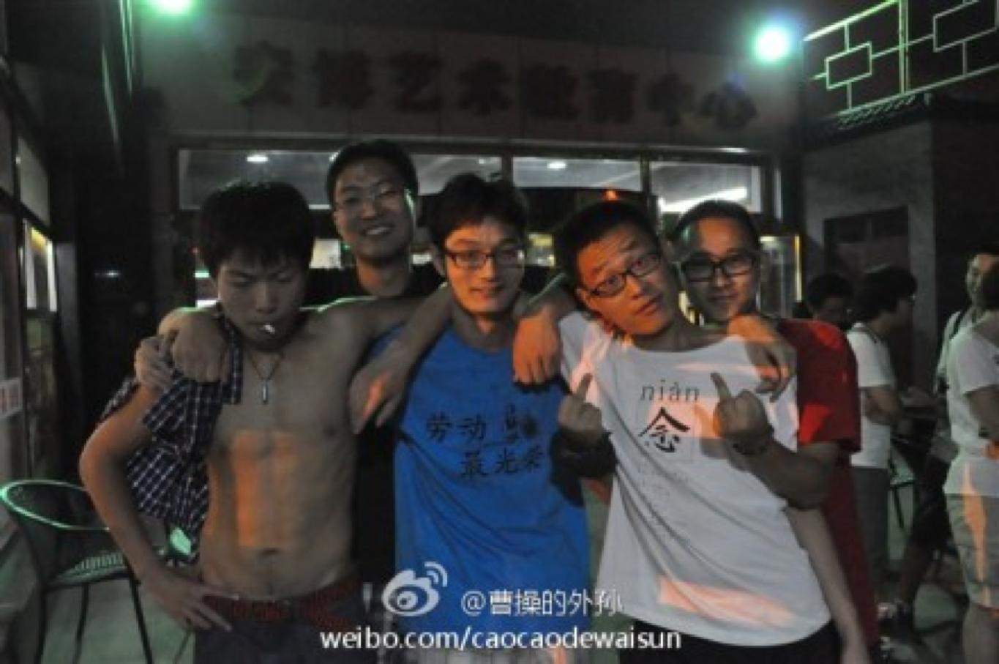
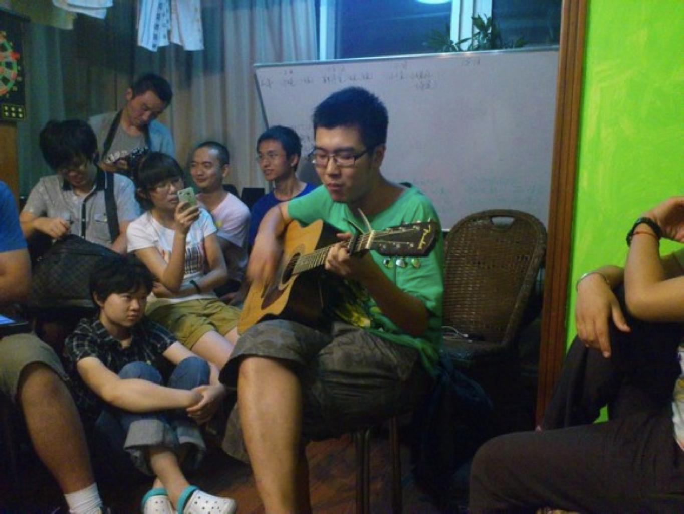

## 想象另一种可能——小记立大，706和自己

**孙健**

~~http://blog.renren.com/blog/285318127/865545998?bfrom=011300082~~

本打算把这记忆埋于心底，等待黎明将它唤醒，但近来看到2组好多人写了回忆文以及co-china营员的文字，感触颇多，再不写写就老了。时间是把杀猪刀，杀的就是我这样懒惰的人。文采似肥虫，文思却如尿崩。飞哥和我说他自己的文字写的像悼文，我估计他是索尔仁尼琴看多了，小时候我看了太多的还珠格格，所以写出来估计会比较滥情，还请电脑前的容嬷嬷们见谅。另外，二组周丹阳等货嚣张欺我706无人，殊不知实力派战将王飞苦于情感纠结，文章难产，706神兽王东把妹不成胸中郁结文章算是怀胎不成。我是一不小心就能受惊，然后受精，写点东西自然如尿崩般飞流直下，写出的是甘泉玉露还是xxxx就不好说了……

回忆多是对于自己，以及一些有意义的事，一些有意思的人。对很多人并不十分了解，凡可说的，都是可以说清楚的，凡不可说的，应当沉默。

开学前的那个晚上，郑重收拾物品打算第二天一早去怀柔，还在纠结要不要把篮球带着。忽闻立大遭遇熊猫围攻，文弱书生无可奈何撤离到小旅馆，义愤填膺，想到自己呆的学校恰是熊猫原产地，也感到很郁闷。心中反复伤感：“理想没入棺底，蛤蟆骤然升起”，后来见了英强，对他说：其实我很抱歉，也许我的筹款活动引起了学校关注给立大带来了不利影响，立大的叫停也许有我百分之几的罪过。英强却很释然，对我说：就算立大因为你关闭了，我们也会因为收到了你这样一个学生而使得第二届立大有价值。理想主义的话语模式，听罢很是感动。我何德何能。

这状况算是比AV台精彩得多的开学第一课。

我愿意用一个滥俗的比喻：在这片风雨飘摇的海上，立大像是一艘风雨飘雨的孤零零的木船，海里的贼偷盗着船板，然而，无论多么破旧渺小，它都可以成为诺亚方舟（没有子）。方舟保留了物种的精英，而立大的很多学员注定在淬火重生的未来，创造出一片新的海。我本就持精英主义立场，这下……更严重鸟。

立大也回答了我一个思考了很久的问题：如果将来社会出现变革，怎么能保证它会合理有序的重建？现在想来我是多虑了，臆想中的困难很大程度上是杞人忧天，民众不是傻逼，社会成员的组织与自治很容易。就像立大虽然形式上被取消，但是后续的重建很大程度上是学员与志愿者的创造力。

开学那天，东直门麦当劳成了反革命分子窝藏之地，最逗的是我接了十几个外地同学，却不知坐在邻桌的是小树等人。有个人和我说，你看，那儿摆着个吉他，一看就像是立人同伴。我说：十号线北漂一族地铁卖唱的多了去了……殊不知，这把吉他是许伟栋的把妹神器。当小树脖子上挂着个毛巾嘴边奶油还没擦干净向我走来，我不禁丹田紧缩——立大的都是什么人哇……

此次立大，我本就是抱着结交天下有志青年的目的而来，导师在帝都大多见过，讲课内容书中也能窥视一二，倒是这帮有意思的人，值得大书特书。

机缘巧合，很多原本熟识的朋友睡在706，于是我从4组叛变到706。前两日纠结于系里派舍友监控我的行踪，错过了不少交流机会，之后索性加入706客厅半夜睡觉袒胸露乳大军。

刘苏里和薛野在万圣那场，正感慨于知识分子的风度，不料父母电话袭来，得知我参与“反革命活动”，勒令次日回家，雨天霹雳更是伤人，手中薯条幻变铁棍，奶昔更如毒鸠，恨不能提刀捉头，结果了令人作呕的学校相关人员。但行走在雨中，渐渐坦然，天将降……必先……用爱化解仇恨……回去和父母沟通几个小时，编造出留校训练马拉松等借口，得以继续留下。

关于导师的讲课内容不必赘述，于我来说这都不是重点，当时看到名单感慨几乎全是奥派右派新儒家，为什么不请一两个左一点的平衡一下呢？现在想来，我觉得想请人家也未必肯来。观点可以争锋，但价值观差异太大。我分析过左右的最大区别，就在于行动上。听说过邓飞免费午餐，薛蛮子微博打拐，包括梁晓燕的西部阳光，英强的办学，从没听过刘仰张宏良发起了什么公益活动（司马小天天这都是钱派，算不得左派）。

下面，回忆一些人，一些事。一些酒，一些爱。

王东算是最早认识的哥们，感慨于东哥屡次把妹不成，想见一见是有多丑……见面了发现除了沧桑些其他都还不错！王东算是真性情，做实事的男人，他的那篇：我为什么参与公共生活，写出了我的心声。那天散伙饭，为了给自己壮胆说出爱字，灌了几瓶酒。2组陈平朗诵了北岛诗，我以为已经很好，王东应声而起，声若洪钟：”这首诗不叫我不相信，叫回答！“

王东朗诵起来：

> 卑鄙是卑鄙者的通行证， 高尚是高尚者的墓志铭，看吧，在那镀金的天空中，飘满了死者弯曲的倒影。

他目光坚毅，脖子上青筋暴起，背到这一段：告诉你吧，世界 ，我--不--相--信！ 纵使你脚下有一千名挑战者， 那就把我算作第一千零一名。”我不相信“四个字，一字一顿，振聋发聩。

王东是纯粹的人，一个人是否纯粹，要看他喝醉了之后的状态。那一天喝醉，王东说了句：”想起文革里死的人，我心里就难受啊“。后来王东还夸了我，健哥给仿民募捐衣服，了不起。其实我何德何能。这些话如果是平日里说出，可能显得矫揉造作，但酒醉之时，表达的都是潜意识。王东那一夜在西门烧烤，和张帅一起唱《九月》，一个叫木头，一个叫马尾……无尽的感伤。别忘了我和你说的：苟有妹，勿相忘。

尼采的精神三境界，骆驼，狮子，孩子。我在向着狮子前进，王东俨然已经是孩子。

谈到喝酒，不妨多说几句，家庭聚会或是跟着父母应酬，敬酒最令我厌恶，所以能逃避的饭局我都推脱，纵使假装来了大姨妈也要极力逃避。但是立人这几天，连续4天喝醉，好不畅快！与你们有精神上的沟通，酒中自可见真情。所有人都发现我酒后两大特点，一是话多，什么故事都往外说，甚至发微博说一些无厘头的话，比如：性是人类进步的一大推动力啊，比如xxx我爱你啊。二是袒胸露乳，衣带渐宽索性脱掉，裤带倒是保持节操从不乱解。这可不是耍流氓也不是秀身材，而是徜徉于情感的海洋之中，虚拟出的游泳姿态。酒酣胸胆尚开张，我辈岂是蓬高人，待到秋来九月八，兄弟相约赴古城。

王东的好基友童焯，可与王东比猥琐。只要是东哥，童焯，王飞和我凑到一起，必少不了约炮话题。童焯没呆几天就走了，走的那天也是喝酒喝到两点，据说他坐在马路边默默哭了，没有见证实乃憾事。第二天一早6点不到，他就收拾好行李去车站，怕打扰兄弟睡觉，没告诉我们。我倒是醒了但是身体不停使唤起不来，没能送送他内心愧疚。

王飞堪称催泪煽情派知识分子，催情功夫一流。得意之作是被转发了40多次的一条微博，号称立大转发量最大。群里聊过，话里显得霸气十足，经常摆出专业理论吓煞我等青年，本想，这货太装逼了。没想到见面有说不出的好感，含蓄内敛，温柔义气。和王飞交流，我渐感自己聒噪浮华，马车越空响声越大。

王飞非常瘦，但一点也不受，相反有一种温柔的攻势。他的身体不知是穷首皓经练就，还是为伊消得人憔悴。王飞特有一种大哥般的气概，为王东挡酒（摧毁周丹阳等人邪恶意图），为我把妹出谋划策。

这三人都算是值得托付的靠谱男青年。

其他一些男青年，尤长阳想问题总是很超前，犀利青年，至于勾搭妹子能力超群却没有谈过恋爱着实难以用生物学解释，唯有一句：这-不-科-学！（2组不是要和706联姻么，首推尤长阳）。

王金晓也是奇葩一大朵，送童焯那天晚上喝醉，搂着我不给我走，早上起床总是可以看到金晓双手护裆，手伸进……（此处省略10000字），看来是要坚决拥护党中央啊！金晓打算休学一年读书行走令我佩服不已，期待明年夏天一起去骑川藏线。

千万不能忘了徐伟栋，弹得一手好吉他。

任真算是少女杀手，平时沉默寡言实则风情万种。我记得散伙饭那天他对我说：其实我们挺像的啊，喜欢打球，平时写一些歪诗。我说你把诗拿出来读一读，他翻着手机郑重其事找了半天，一脸无辜望着我：没找到……

说到诗，对我而言算是最有意思的回忆。徐晓老师家，轮流读着《今天》上的诗，气氛圣洁肃穆，我也不怕丢人找出自己写的读了出来，这是第一次在众人面前读诗，也是第一次读自己的诗，欣慰的是，没人说：你写的什么鸟东西。有人懂，就有共鸣。写诗源于懒惰和对自己文笔无能的补救。最美好的体验是6月前三天每天写了一首，气血上涌，自认写的还不错。这里贴上一段前天写的：

> 暴君敲响丧钟
>
> 尸体贴上号码
>
> 排着队
>
> 落日旁起舞
>
> 对照海面
>
> 刽子手谋杀自己

北大西门烧烤，酒到兴处，不管有没有人听，也不管众人醉的能否还有听觉，读尽了手机里存的近十首，直至电量耗尽。读罢怆然。

在中国，诗与理想主义是同父异母的兄弟，理想究竟价值几何？在和立大友人相处的时间里，我发现精神世界有比表象世界值得追求的一面。克里斯特兰德放弃”美好“生活，去塔西提追寻精神世界的故事曾深深打动我，其实立人的朋友，又何尝不可能拥有另一种生活的可能？很多人愿意放弃一些，却得到无法用秤砣衡量的重量。

不提弥赛亚情结，光是普罗米修斯的故事就是指引我生活的一道射线，我想要打破的，恰恰如加缪所说： 如果普罗米修斯归来，现代人会如古代诸神那般待他：以人道主义之名将他钉上悬岩，而他恰恰是人道主义的先驱。羞辱这位失意的受难者的敌视之音，正是回荡在埃斯库罗斯悲剧开场的那些声音：武力与暴力之声。

如果这还是虚的，还是可望不可及抑或常人难以达到的，那么我更愿意用康德绝对的道德命令来约束自己的行为，我相信很多朋友也是这么在约束自己。

高中一个朋友喜欢这句话，我也爱上了这首诗：

> Two roads diverged in a wood,
>
> and I---I took the one less traveled by,
>
> And that has made all the difference

人的意义为何？前苏格拉底时代的希腊哲人就开始思考，这个问题始终没有确切的答案，但我想世俗生活中所谓”好生活“绝不是答案。理想主义谈的多了肯定招骂，多数人定会批评：理想又不能当饭吃。然而，在我的价值观中，理想是可以当菜吃的，顿顿馒头土豆丝外加精神世界，绝对胜于大腹便便坐在山珍海味边饕餮。——那时我们有梦，关于文学，关于爱情，关于穿越世界的旅行。如今我们深夜饮酒，杯子碰到一起，都是梦破碎的声音。这一句，破碎的声音，望永不实现。

扯到太多感悟，忘掉介绍706的神女们。此次立大收获之一就是些许改变甚至重塑的我的爱情观。以前很羡慕萨特波伏娃的爱情，认为可望不可即，吾乃凡人，不如望着白花花的大腿流口水实在。但是接触了一些立大女生，发现我对美女的兴趣骤减。上帝的不公平性体现在有人生来有钱包，有人生来长得好，而我何必追求先天胜人一等的美女呢。思想的填充物抑或内涵与气质，更有经久不变的吸引力，好比佳酿需要时间的沉淀。在我的生命哲学中，身体与精神是合二为一的，男人不必拥有完美的脸庞，而要锤炼自己的身体，女人的诱人之处则要在于闪烁动人的光辉。这也是古典时代的美的品味。亚里士多德曾说：灵魂是所有生命体的原则。

曲玮玮是令人难忘的姑娘。初去706，讲自己的故事，她提到罗素的那句：三种单纯然而极其强烈的激情支配着我的一生，那就是对爱的渴望，对知识的追求，以及对人类苦难悲天悯人的情怀。当时一个激灵，这不是我的座右铭嘛。瞬间产生共鸣。我自愧文笔差她挺远，想想自己17岁还很肤浅。她的成熟性隐藏在萝莉的外表下，很难捉摸。

盛俞婷和赵梦迪是很细心的姑娘，分别之前特地买了蛋糕，让众人情何以堪。赵梦迪还是个喜欢摇滚的姑娘，看好你们哇。

唐双飞很早就认识，对朋友很关心。这次立大刚结束就去山里修行几天，佩服佩服。

刘磊和她说话不多，不过很喜欢她的性格，特别是调戏曾嘉俊的时候……记得她对我说：健哥我挺你。

张元和谢宇放到一块（谢宇也算女生吧），706第一对，相当给力。作为大通铺版非诚勿扰，完爆新东方模联一条街。下次建议不要男生女生分开睡，众人都是有节操的，不会发生什么，但是肯定会有更多对。

凡不可说的，应当沉默。还望没有提到的哥们姐们见谅，还望提到的朋友若偶有冒犯也请见谅，还望电脑前的容嬷嬷们别掏出针来，还望别的组看热闹看的愉快。

未名湖之行，神志不清的众人对着博雅塔各说了一句话，以此结尾（只记得这几句）

王飞：未来的历史由我们创造

薛岳：青春万岁，不负此生

黄子懿：人生漫漫，且歌且行

健哥：三种单纯然而极其强烈的……………………………………

后会有期。在没有黑暗的地方，再见。

