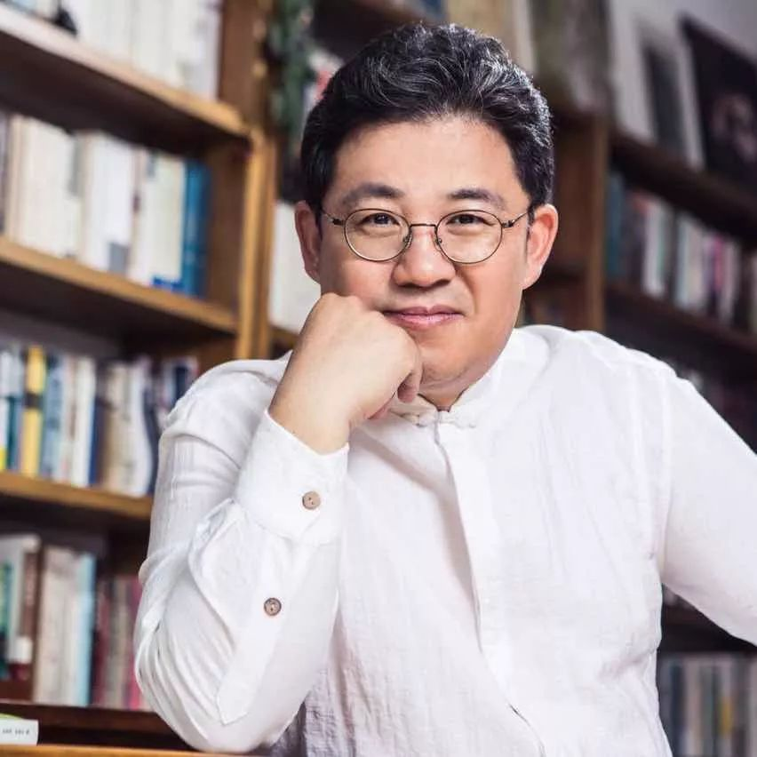
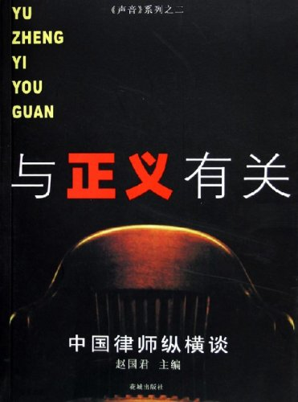

## 赵国君：我的学思历程

> 授权转自「游思学社」

很高兴与在座的各位交流，你们能够在这个时代怀有问题意识真是非常难得，所以当世存兄和我一约，我就很感兴趣。

我的学思历程，说简单也简单，说复杂也复杂，复杂到我现在也不知道自己在做什么，好像什么都在做，简单说呢，就是我从来没有上过什么正经的学校，一切都是自学而来。

我是中专（河北税务学校）毕业生。高中的时候很自负，学习特别棒，文科班里永远的第一名，没有考过第二，觉得自己是非北大清华不上的那种学生，但后来高考失利，梦想破碎。那个年代（1990年），家里还非常困难，复读的钱都拿不出来，连上中专的二百多元钱都是找人救济的。所以，只能考什么上什么，于是就饮恨上了那个中专。在那个年代，上个中专读税务也算不错了，92年毕业后分配到税务部门工作，做税吏，很让人郁闷，**税吏属于那种「不能上天堂的人」**。先是在一个镇的税务所工作了四年，市局稽查局三年，由于特别恐惧受贿，几次吃喝应酬后，发现自己被钱和物包围着，就有些害怕。毕竟农家出生，虽然经济匮乏，做这种事总觉得不安，可农家子弟做了公务员，面孔对准了过去的阶层，就很分裂。于是申请调到税政科，专门管税收政策的一个部门，一直干到了03年。就这样，在税务机关工作了十一年。税务局一直是我的痛苦之源，直到现在，我的微博言论中从不遮蔽自己对公务员的批评，特别讨厌，到现在也不能容忍。尽管我没有完全进入它的主流，只是普通的公务员，但毕竟也有一定的权力在手，算是有些感触，那就是我感到十分的无聊，很痛苦（那种精神的痛苦我相信在座的都有感触），也很焦虑。有人觉得我这种的焦虑很虚伪，因为本身那个环境还好，世俗上觉得那很好，不愁吃不愁穿的，但是从92年毕业到03年我从税务机关出来，一直保持着阅读的习惯。小学、中学对人的影响是很大的，到现在我都没改变高中的学习习惯，高中时你不是考第一吗？考第一很少有偏科的，基本是面面俱到的。我最爱学语文和历史，但必须兼顾不喜欢的数学和英语，这样就造成了一种均衡。看书也是面面俱到，既匮乏又心虚，说好听点儿是博览群书，什么都看，政治历史文学戏剧艺术法律等等都来者不拒，但是要说深呢，就很难在一个特别学科钻得很深。面面俱到没问题，直到现在还能唬人，好像什么都懂，一会儿谈历史，一会儿说经济，事实上，再谈多了可能就露馅了。

还好，税务机关除了讨厌的部分，由于有世俗意义的保证，让我有大量的时间阅读，那时候读书入迷，常常是从晚上八点到凌晨两点，一杯茶伴着，做了大量的读书笔记。我读书喜欢做笔记，现在也是，家里的读书笔记厚厚一摞，特别好的东西就背下来。所以脑子里就有很多经典的语句，比较多的是一些作者的观点和重要论述，几乎都能背下来。**这也是胡适教傅斯年的一种学习办法，胡适当年告诉傅斯年「如果你发现这句话很重要、这个故事很美妙，你要趁机写一篇文章。** 这句话嵌在你的文章里，慢慢就内化成了你的记忆和思路（大体是这个意思）。很有感触。在税务机关这段时间里大量的阅读，大量的笔记，奠定了后来到北京的基础。如今大家觉得我很幸运，能够和知识名流打成一片，其实有一个前提就是我早就知道他们的书和他们的一些观点，在税务机关完成的就是一个初步的积累，但我比较偏向法学，喜欢法学，尽管其他的人文阅读没有断过，法学的动态还是比较关注。你们能相信吗？一个普通的公务员自定书刊12种，其中居然有《政法论坛》、《北大学报（社科版）》、《中国律师》、《刑事司法证据研究》、《南方周末》等等，那时候对学习有一种饥渴的状态，直到现在好奇心依然主导着求知之路，这种感觉很饱满，也很快乐，尤其当它的目的性不是很强的话，如你必须为了论文，为了发表去储备知识去糊口的话，真的很快乐。

从最早成为刘苏里的万圣书园的会员，到最后关注天则经济研究所，慢慢地开始和一些作者有了联系。因为越读书就会越有这种冲动。**除了自然冲动，还有一个，那就是你要和一个名人打交道，一定要带着问题去，不要只带着仰慕，因为仰慕对他来说太平常了，大家都很赞美他，都很喜欢他，多一个少一个印象不大，但你带着一个尖锐的问题，或者带着一个问题意识去，引起他的注意，就会形成一种灵魂上的伙伴或者对话的状态。** 事实上这是交友的一个特点，要养成一种灵魂上的平等，就得有点真才实学的见识与趣味才好，这样特别容易形成对话，吸引对方，也容易形成真正的至交。

在税务机关的这段历程非常感喟。因为苦闷，因为没有考上大学的遗憾就读了一些书，有什么用，也不知道，因为在税务机关完全不需要这些，读多了还有一种不合时宜的迂腐，就很分裂，很痛苦，因为没有人跟你说话，他们的话语系统跟你不一样，那种痛苦真是「理想很丰满，现实很骨感」。然后，就独自出去「寻欢」，在那样一个封闭落后的小城市寻找其他的读书人，有电视台的，经商的，上学的，反正不是本系统的，形成了一个小小的「圈子」。大家在一起探讨的都是周围人看来「不着边际」的话题。我觉得，这个自幼读书人圈子对我也有一个影响。所以，我完全是一个野孩子，不能说自学成才，因为现在我还一肚子问题没有解决，但自我阅读增强了我的心性，虽在体制内，早就叛骨生长，恨不得夺门而逃。

2003年一次偶然的机会，在《中国律师》杂志上看到了政法大学的招生简章，是一个不用考试的在职研修班，恰好符合条件，就去报了个名。于是便去和领导打招呼，告诉他我要去上学，领导当时很诧异，以为我想和他提什么条件提拔啊升职啊送礼啊什么的，得知我要去上学，他或许感叹：真是个提不起来的傻子。他非常愉快地答应了我，借着这个机会我就到了京城，出来之后在法大呆了两年，那两年对我的影响最大，把我在前十几年的自我阅读大大地规范了，严谨了，有了那么一点学术意识，现在看来，其实很浅。那时候在法大，认识了一批各地来的朋友，我岁数大就成了领头羊，像咱们这个学习小组一样一起学习。记得我们很兴奋地抄课表，法大的课表，北大的课表都抄，于是就这两个学校来回的听讲座。没有任何的师承门派，也不讲专业，当然集中在法学，盯着名师走，盯着兴趣走，并且那时候天则经济研究所正火的时候，正好在五塔寺，离法大也不远，我记得当时朋友几个在这三点上来回转，真是求知若渴的样子。那时学习，没有任何功利的，特别好奇，怀着一种特别冲动的渴望，去听，去蹭讲座，矮油，感觉特别棒。因为当时听了很多专业老师的课，后来做事跟他们早期都熟，联络起来自然方便。天则、北大、法大，游学的状态，像蜜蜂采花，在北京就这样上了两年学。

上学期间，一次偶然的机会，到广东做了一次法律援助，顺道看了下在广州的林贤治老师，林贤至老师是一个诗人，也是一个出版家，在花城出版社，他研究过鲁迅，《人间鲁迅》就是他最早写出来的。他很悲情，你要是说他左右之分呢，他有点左的特点，但立场完全在底层的，像鲁迅那样完全是站在人民大众一边的。那是我俩第一次见面，在这之前早已通信联络多时，还曾邮寄过他的书给我，算是神交已久的师长了。闲谈中他突然委托我做一本书。那时候是零四年，胡温新政刚开始，底层问题浮现出来了，宪政也喊出来了，他想做了一套叫做声音丛书，**因为借着鲁迅的一句话，「现在是一个无声的中国，要把无声中国变成有声中国」，就是根据这个意思来的。** 丛书的第一个作者是北师大的黄娟博士，做的叫《农民！农民！》，我那本呢，叫《律师！律师！》，觉得有点太那个，后来就把书名改成了《与正义有关：中国律师纵横谈》。本来叫访谈录，后来又发现心中理想的律师不够，然后就把贺卫方，江平，马怀德、蔡定剑、何兵、许志永等学者邀请过来做访谈，凑成了一本书，共计17个人，本来有浦志强的，访谈都做完了，不期快交稿了他要求撤出来。那本书在法学界的影响不大，因为根本没人知道我是谁，现在好像也没什么人知道，但那本书给我在法学界做事奠定了一点基础，这个基就是我确实抓到了法学界最好的一批人，也是最有担当和气质的一批人，真是歪打误撞的幸运。书出版了别人也不知道我是谁，可自己收获却很大。我跟这些人：张思之、田文昌、许志永，包括现在被逼到海外的郭国汀都做过深度的讨论，对我影响特别大。这是所谓的学法经历，不过是在博览群书中的一次转场，很难说是什么律专业出来的，只是对法学有了点认识，培养了一点法学思维，但，最重要的，认识了一批极有责任感的法律人。

到北京的生活也有焦虑，就是不知道自己干什么好？好不容易从体制出来了，肯定不想回去了，一开始想干律师，做律师最适合了，写完书之后也不想做律师了（当然也有没通过司法考试的原因）。**律师不是想象的那样义正词严，问题跟其他行业都差不多，充满了让人讨厌的东西。** 后来发现，不做律师，那做律师的朋友——媒体人，做记者吧，在北京做北漂随时可以找到这样的行当，可后来发现自己就是媒体！想干什么干什么，完全不必去别的媒体，一个人做，多好！首先就是策划，给出版社策划，很激动，也很热情，看得多，想法多，现在回头看，很多都是没有落实的大话，但是很会激励自己，白日梦帮我度过艰难岁月。前两天还跟女儿说「刚到北京的时候自己想做的事做不完，那时候谁也不认识我，今天弄这个，明天弄那个，后来发现都没落实，但觉得很激励，就发现，哇，这么多事啊」，**自我欺骗的时候，三分钟热度也是可贵的。**

紧接着就写了第二本书，因为第一本书也采访了周立太，他是专门给因工伤而残疾的民工打官司的律师，与他相识不久，就约我给他单独写了一本书，我去了重庆，他的律师事务所，住了三个月交稿，转眼已经到了第二年，也就是2005年的春天，写完了，也快毕业了，就思索自己要干什么，朦朦胧胧的，没有太明确的方向。

2005年，我开始试着做了几期活动，取名叫「走进中国律师」，计划十期。虽然我对中国律师很不满，但直到今天，对律师依然怀有正向的肯定，因为受美国法治比较发达的影响，觉得律师的社会作用是十分巨大的，理应成为一个有担当的有社会责任的人权律师，即便只成为本职上有操守的职业律师也很了不得了，所以，律师的正向价值让我激动。我觉得在世俗意义上的律师是一个最有领袖气质的职业，因为律师们知道规则所在，知道人世间的喜怒哀乐，最了解民间疾苦与上层规则，特别想弘扬律师的这一点。活动策划了十期，只进行了两期就收不住了。第一期在政法大学举行，刑事辩护律师钱列阳做第一讲，贺卫方教授点评，一个律师讲，一个法学家点评，效果太棒了，整个教室挤满了人，窗棂子上都站满了人，有人掉下去了还得爬上去，效果很棒。主要是这两个人都有故事，贺卫方更是名满天下。第二期在北师大，由田文昌律师主讲，北大的陈瑞华教授点评，敬文学堂里面座无虚席，效果也很棒。两次活动让我终于找到了自己的价值和定位，那就是在社会上做法律的布道者，弘扬法律精神，倡导法治理念，于是，我就成了社会活动家，组织各种论坛、讲座和沙龙，核心是言论自由与结社自由的努力尝试，很符合在法大攻读的方向，我的方向是宪法学。

2006年是真正的转折，这年春我成立了中国律师观察网。成立的时候还不知道叫什么，但做活动就得有个主办方，但就我一个人，叫什么单位？突然想到的就叫中国律师观察中心吧，很大的一个名字，不过在法大北门租了个小房子，也就是我的住所，一个十几平方米的合租小屋，中国律师观察网诞生了。那时候政策宽松，申请后马上就批准了，从此开始做「嘉言论坛」。

第一期论坛源于社会上的一个热点案件，一个叫蒋石林的普通人状告财政局。财政局没惹他，但他看到财政局的房子、车过于豪华，告的就是这个，牛逼啊，这么「多管闲事」并不是闲事，而是充满了公民精神，在学理上这叫「纳税人诉讼」，就是你跟这个事件好像没有利害关系，但还是有关系的，因为你是纳税人，有权利监督政府怎样花钱，这个叫纳税人诉讼。作为纳税人想监督税款落实，到底是怎么落实的，是不是有贪污，有知情权和监督权，在学界是一个很平常的常识，但社会上却罕有这个意识。第一期邀请的嘉宾也很好，茅于轼老师作为经济学家，刘剑文作为北大的税法专家，政法大学的施正文教授是研究税法的核心人物。还有一个从日本留学回来的民法教授，也有北京大兴税务局维权中心的负责人，居然是夏明翰的后代，这些不同专业不同部门的人组成的论坛开得效果十分好，给我带来的振奋可想而知。从此以后，我就越来越笃定了要做社会活动的信心，抓住社会上的热点事件，法学界的各种信息做法律公共论坛，真是一发不可收拾。从2006年4月开始，一直做到年底，关注律师执业自由、纪念米兰达规则、探讨打黑运动中的财产问题等等，都是很有影响力的主题。我们根据历史事件，现实事件或一本书引起的话题做社会活动，做得风风火火。

当时的心气很旺，觉得能够以公益的面貌来批评社会，关注司法变革，是很有意义的事情。从那时开始一直做到了零八年奥运，两年的时间共计做了二十八期。期间也出现一个弊端，就是嘉宾经常重复，后来才发现，真正能站出来在民间独立的论坛上讲话的没几个，敢说的老师就那几个。**大部分老师都太平庸了，就跟公务机关混日子一样，在专业主义的陷阱里在课堂上忽悠学生，「诱奸」学生，真正有良心的学者就那么几个。**

2008年，国内环境变了，就是社会活动受到了很大的压力，借着奥运的限制并没有因为奥运结束而结束，而是变本加厉，控制更严，我们上当了。生活没有去处，借一个朋友的介绍去了吉利大学教书，但是没教两个月，由于「不可抗拒因素」被迫离开。离开时同事及学生们都哭了，因为我是最受欢迎的老师。迎新教育会上，家长因我的演讲而备受鼓舞，那些不爱学习的孩子也喜欢听我讲文化、讲历史，不但讲课，还在学院办人文讲座，全院的师生都喜欢听我讲，院领导居然让我做副手帮他一起管理学生后，可以说那是我非常开心的一段日子，但就这样被生生地打断了。离开吉利，自己也不知道做什么好，写书、看书，在这个过程中《法制日报》的一帮哥们儿拉我去做主编，他们的报纸要市场化，准备做《南方周末》类的社会化报纸，于是就想到我这个敢干的散人。从09年1月1日起，在《法制日报》做了将近一年半，一开始还好，因为我是一个特殊人物，算特聘的，很自由，负责好几个板块，做的不错。官僚十足的报社领导居然很喜欢我，因为大量稿子都是我写，我约的，一个人几乎做了大半工作，尽管我不坐班，不开会，不参加他们的应酬，但出活儿，也有想法，他们还觉得这个人不错，虽然很屌。**突然来了一个特别操蛋的领导，一个机关干部式的人物，把办报的方针全打乱了。不自由，毋宁死，我说的是选题的自由和写作的自由，眼看着报纸毁在了傻逼手里，就准备走。** 后来领导知道了，特别又把我留在了法制网，好像是还给了个什么主编的岗位。策划主持网络的视频频道，也是自我做主那种。可我天生反对坐班，极具理想型且锋芒毕露，网络的专栏类似法律脱口秀，取名叫「法治天下」，但因为内容太热点性，好多选题居然被以法制著称的领导毙掉了，是可忍孰不可忍。此等不快，片刻不能久留，于是挂冠而去，再度辞职。

辞职之后，偶然遇到一个法大的师兄，他在天津做了个艺术博物馆，虽然搞艺术博物馆，却不改法律人本色，身怀理想，特别关心社会。偶然的机会，吴祚来老师把我介绍给他，就一起做了一个「艺术独立论坛」，也是在当代艺术界做公共活动，还是我的老本行。艺术独立论坛意在于艺术界传播新知，于是就把好多认识的学者拉了艺过来和艺术对接，贺卫方，雷颐，吴祚来，江平与老栗等合作就形成了一个公共平台。听起来就很有意思，做起来就特别好玩。因为这个国家里任何行业都是相通的，艺术面临的东西和我们一样，艺术自由的问题、市场的规范化问题，艺术家的社会责任问题都值得关注。借着画展画册电影展览搞了很多论坛讲座，很跨界，如让法学的贺卫方与行为艺术的苏紫紫对话，让莫少平律师与日本艺术家清水惠美探讨艺术中的法治，让社会学者于建嵘与以上访为创作题材的艺术家张鉴强对话等等。这样的论坛既有味道又有深度，而且一改艺术界的浅薄，把艺术作为背景，聊艺术本身，也聊艺术与社会、艺术与法律，极富活力。

后来又开了名家讲坛，袁伟时、傅国涌、吴思、茅于轼、周孝正、冉云飞等等名家为艺术家普及人文知识，办得也很成功。

这样下来，我的形象变得非常复杂、模糊，好像是法律，好像是艺术，可哪头也不是我的专业，我没有专业，因为不认同专业壁垒，就喜欢不同专业之间的交流。这多少与我在法大受的教育有关，因为与宪法学走得近，为了言论自由结社自由而努力就是我的理想。这种努力很有意思，并不复杂，人天生具有结社的冲动，天生有交流的欲望，人的社会性就体现在这种交流，除了饮食、亲情、社会伦理之外，人更愿意交流思想，表达对事件、人生的看法，所以说做这种活动就很能说服自己，也觉得很有意义。

做任何社会活动，或公益，或慈善，一开始你会觉得自己很牛，后来越做得多，你会发现越平常。公益也好，社会活动也会不过是你的想法点燃了很多人的想法，你的理想点燃了很多人的理想，热心连着热心就做起来了，貌似你想改变整个世界，后来发现不过一小群，不过是自己，是的，最终是改变了自己，把自身的毒素慢慢排出，来迎接阳光与爱的力量。伟大高尚变成了高级自私，这么说，是想以自己的经验提醒各位：**不必太拔高意义，尽管我们的事业极有意义，这个自信自不待言，但一样该脚踩大地，该承担各种不务虚名的东西甚至误解，是的，我现在还被许多流言蜚语包围着，居然不是某种对立面，就是身边和你一样有追求的人。你会发现，我们都在排毒，只不过是看谁更干净些。**

还有一点，做社会活动的组织者很容易消弭自己的身份属性，很容易把自己变成不着边际的碎片，这是应该承担的代价，因为职业本身需要此种「牺牲」，你明显的没有专家或固定的职业身份，看上去很晃，很虚，我也有过这方面的焦虑和苦恼，但最终还是说服了自己。**没有身份恰恰是法治的真精神，也是公民社会的常态。** 如梅因所说的「由身份到契约」，契约生活很自由，使自己不必固定在太狭隘的领域里，又保持冲动，保持好奇，你会发现你的财富居然是大把自由支配的时间，你可以在这样的时间里做任何你想做的事，简直是极端幸运与奢侈，那是一种天然自足的超然。收入不稳？不怕，饿不着，咱这么有干劲儿有理想，活着还是问题嘛。

每天有那么好书可以读，有那么多电影纪录片要看，那么多相见恨晚的朋友，那么多有意义的活动等着我去办，还有美酒、爱情，真是「不做无益之事，何谴有涯之生」？如此，精神饱满，日日补充，徐徐而动，静静欣赏，生命中的一切都尽可来之，真是快乐、幸福。
