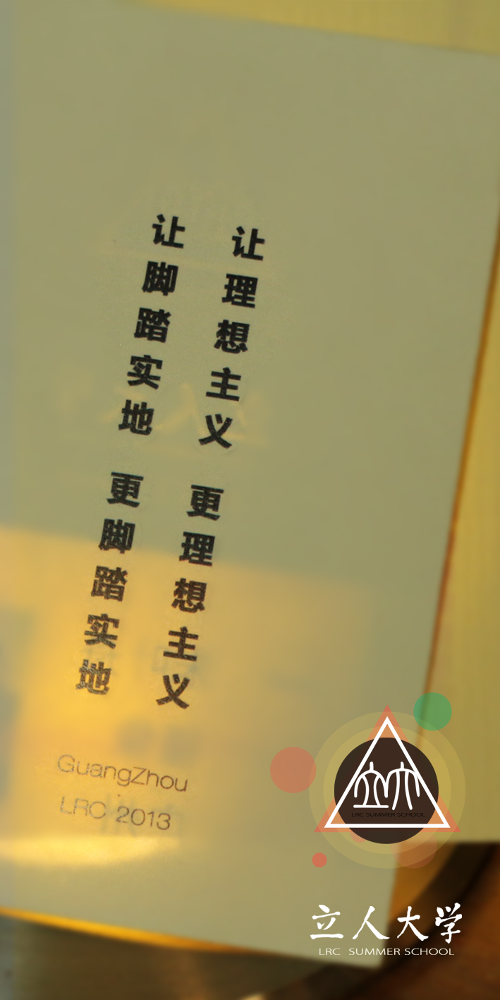

## 第三期广州组

**活动要旨**

让参加的学生感受一次真正的大学教育，以自由、开放的方式探索民间高等教育的可能形式。

**活动时间**

2013年7月15日至7月31日

**组织形式**

- 游学：课程、活动形式多样，有一定的地点不确定性，在城市游走、寻访「有意思的人」，同时集中开设部分以「培养整全的人」为目标的通识教育课程。

- 一起办学：导师、义工、学员一起办大学，基于自愿，自主教育、学习，并吸收社会捐助。

**活动内容**

- 内容：通识教育+地方特色文化游览+学生自主活动

- 形式：学术讲座&讨论、读书会、参观体验、人文徒步、文艺观演、青年分享、议事+城市特色活动

**游学主题：民间公益与公民行动**

- 岭南文化：体会广东特色的粤语、粤剧等本土传统文化，以及保留较为完整的宗族文化。

- 公民社会：体会广州开放的公民社会及其间的民间公益组织。

- 南方传媒：对话岭南新闻传媒界人士，理解媒介与社会、个人与信息的关系。

**课程**

- 特色活动：公益组织拜访【包括教育类、环保类、残疾人扶助类、麻风病村康复者关怀类、NGO支持类、城市建设类、同性恋组织类、社工机构类、女权主义类】、宿营与天文观测、植物观测、摇滚音乐

1.通识教育（含人文、社科、自然科学）

2.民间公益与公民行动

3.对话传媒人士

4.体会岭南文化

5.广州古城&书店游

6.工厂区&城中村体验
