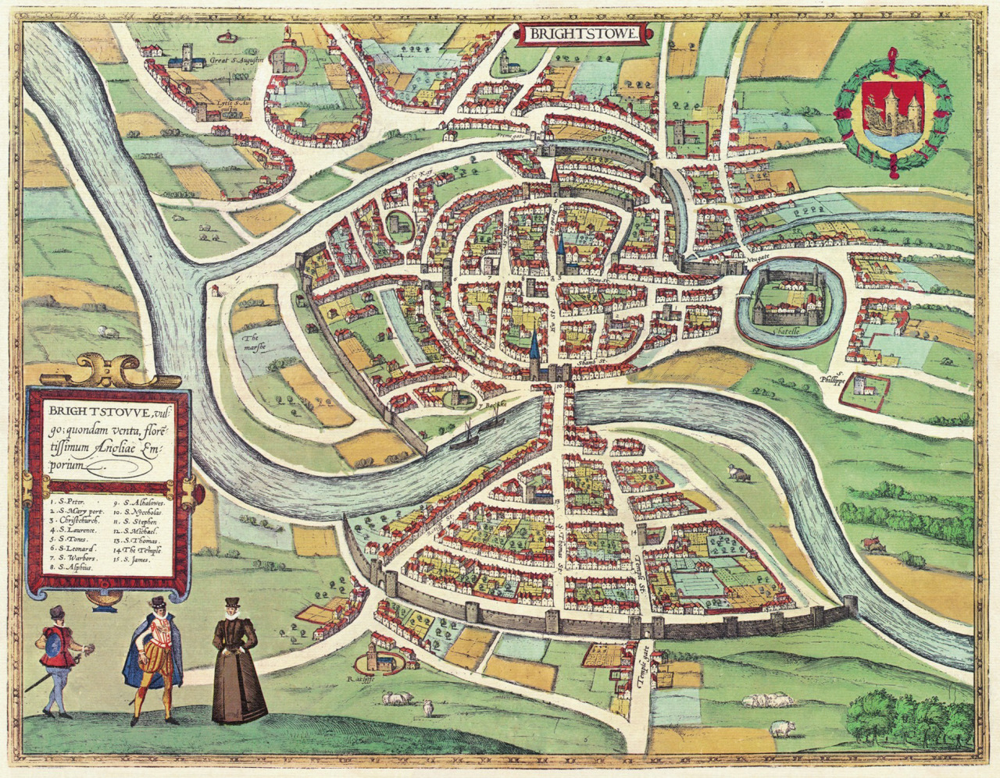
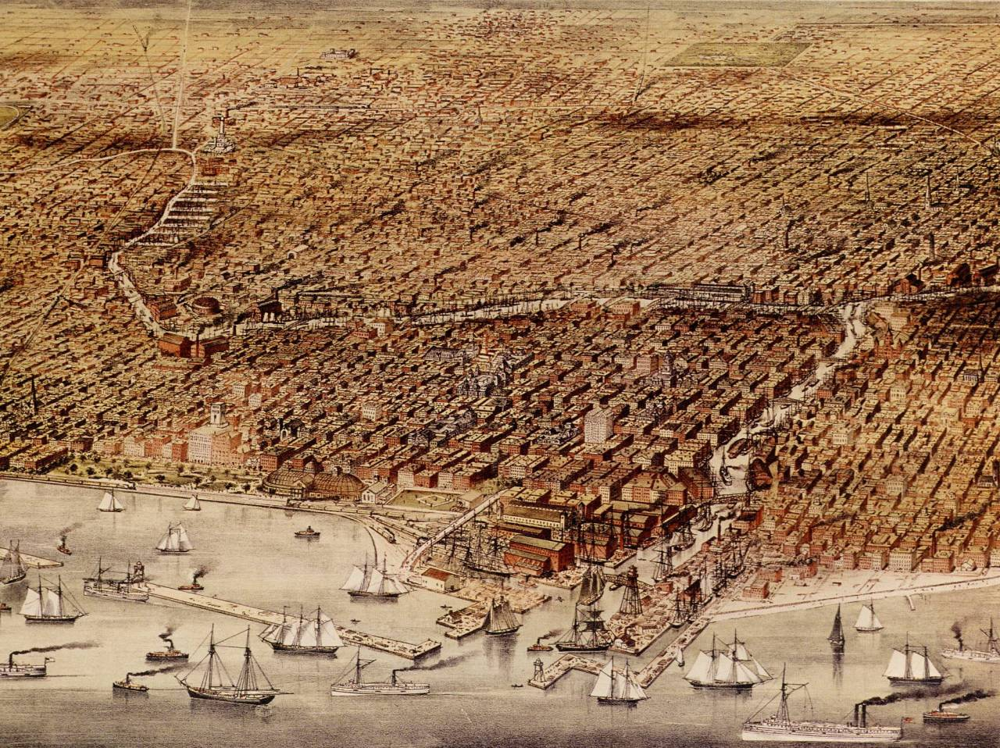
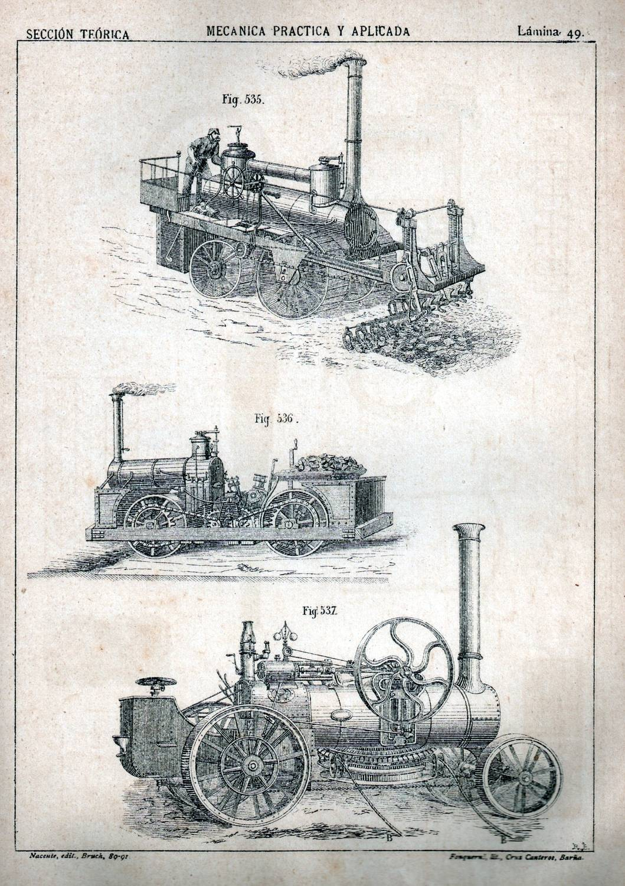
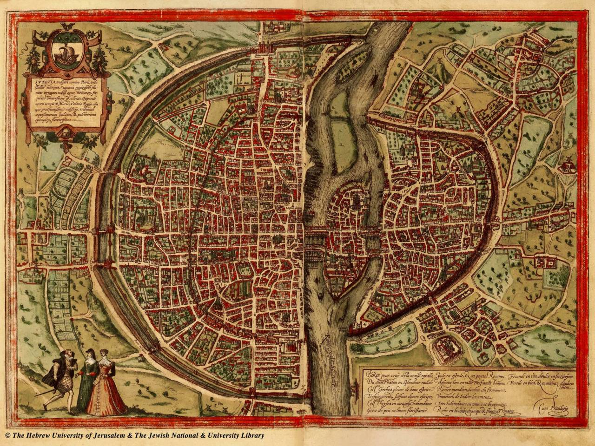
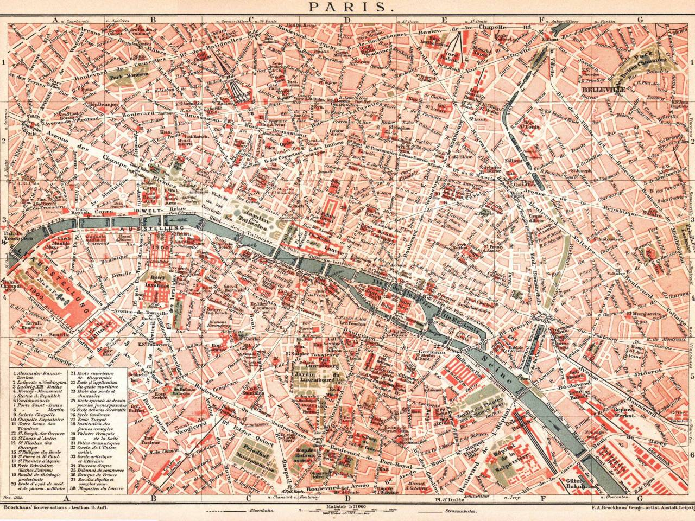
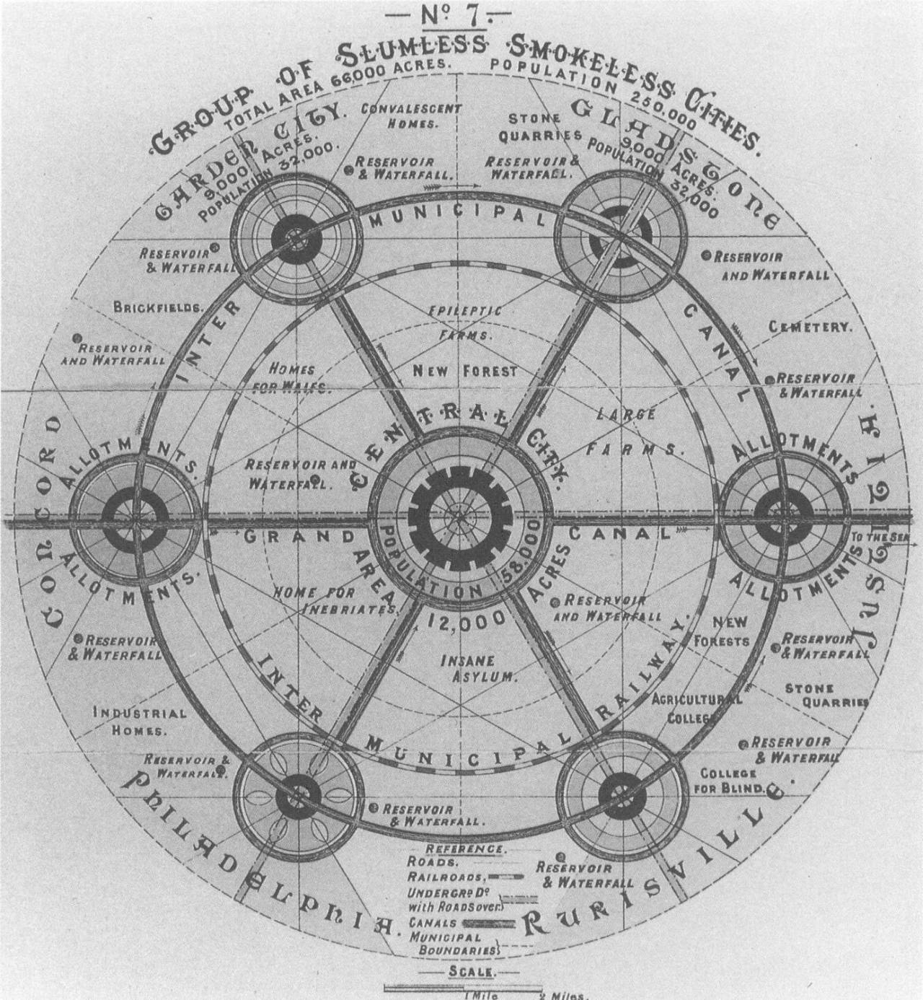
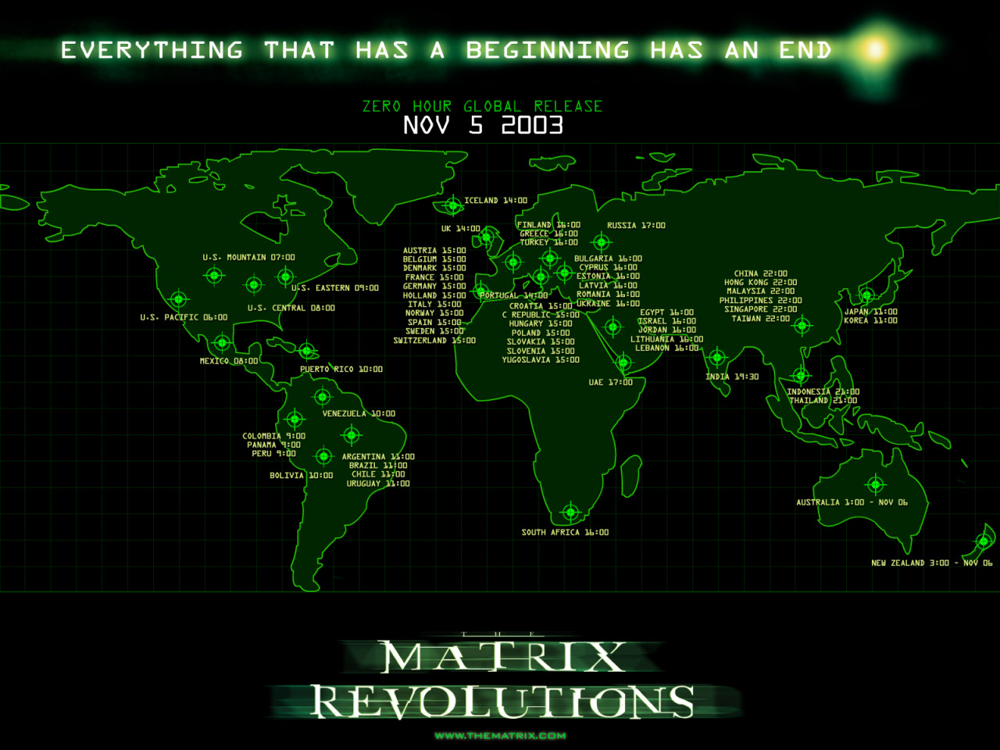
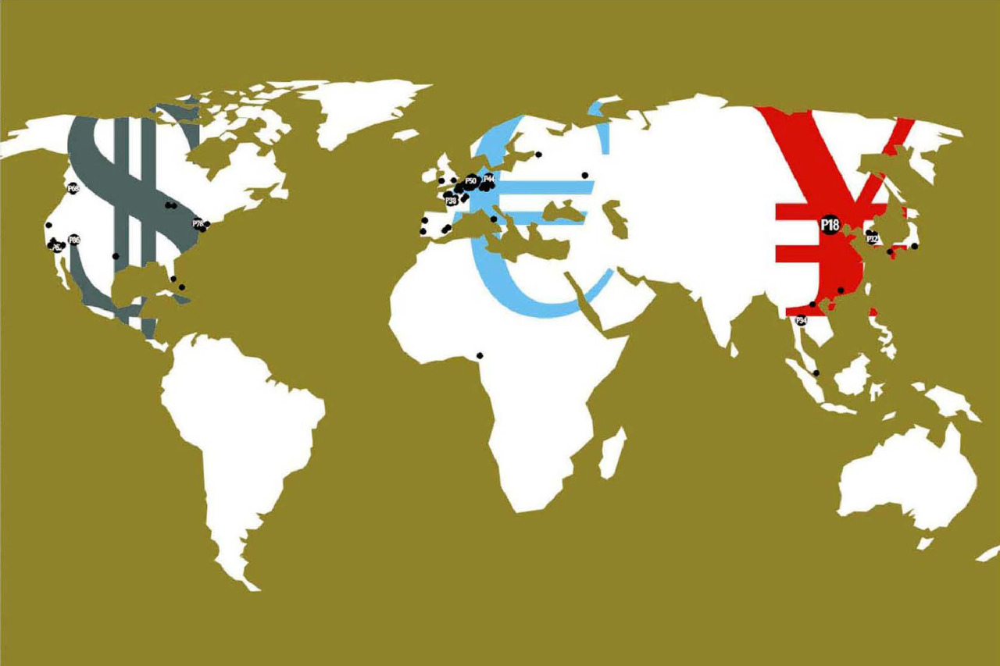
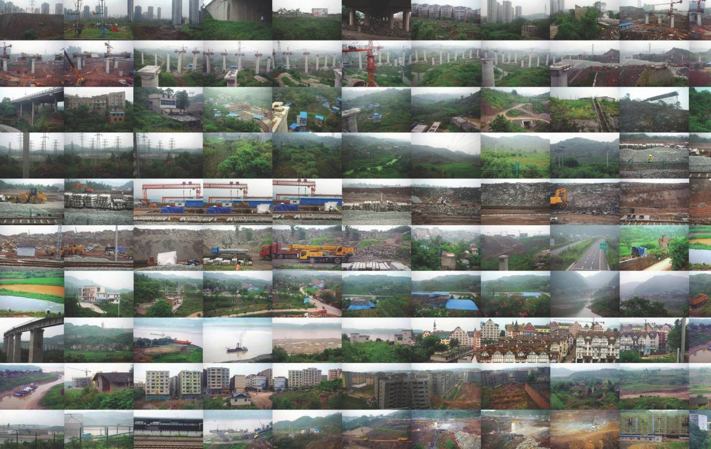

## 中国城市化

讲者：朱晔

整理：郑思源、陈玫

**朱晔**：我先自我介绍一下，我叫朱晔，曾经编过一本杂志《城市中国》，是《城市中国》的主编。现在我的工作就在你们在的这个地方，我是这个艺术中心的总监，包括你们来上课也是你们的工作人员跟我们联系过。我自己也在广州美院任教，也带学生做课题，我的研究方向很复杂，基本上城市化是我研究的一个方向。同学们对城市感兴趣吧？

**学员**：感兴趣。

**朱晔**：有没有同学谈谈你们理解的城市是怎么样的？

**学员**：城市就是工业化。

**朱晔**：你讲得很好，我觉得能讲到工业化，这个理解已经很好了，我讲的是现代城市，现代意义上的城市确实是在工业化之后产生的，但是最早的城市是很早很早的，在周王朝封建时期就有城市了。

「城」跟「市」我们有两个方面理解。「城」相当于围墙，以前要打仗，有城市有人类聚居了，我要住在城里面，中国有句老话叫「筑城以为君，造郭以为民」，造这个城出来是不让别人抢我的粮食，不让别人抢我的东西，所以就有个城，是城墙的意思。「市」就是 market , 你们学过《木兰辞》，里面有「南市买辔头，北市买长鞭」，市就是城里的集市。为了防御和交易的需要，有了人类最早的城市。当代城市的演进、城市化是因为工业革命的到来出现的。

我们来叙述一下我们的课题，我可能在一个半小时之内给大家讲中国当代的城市化，实际上也就是从政治经济学的角度，要对我们中国从 1949 年到现在跟城市、空间相关的历史进行一次回顾和小结。这个背后更重要的是一些理解的方式和方法。

因为城市化是中国社会发展到现在最大的一个动力，如果没有城市化，同学们不会有到国际单位开展活动的机会。因为国际单位是一个旧改项目，它以前是个农村，城市升级之后，变成了一个轻工业的基地，城市需要升值，升值最关键的动力在哪里呢？在于它的生产资料的增值，增值就在土地增值上面，所以产业要做升级，要变成一个商业地产项目或者文化创意园区的项目，才会盖起这样的一些东西。我们现在上课的咖啡厅，以前就是乡镇企业的工厂，把两层打通做了一个咖啡厅。如果没有城市化的进程，我们就享受不到这样的成果。所以，**城市化是当代中国关键的动力。**

做地主是很幸福的，因为如果大家的家庭在城市里买房的话，买的是 70 年的使用权，并没有买下面的那块地，地永远是属于国家的，不属于使用者。作为生产资料，国家以全体人民的名义拥有它们。

我们来讲讲我们课程的对象，主要是 49 年以后的中国。那么，城市化尤其指后 30 年，也就是 78 年改革开放以后，尤其是 1991 年以后的城市化进程作为我们叙述的一个重点，因为 91 年以后土地可以流转，91 年以前土地在政府的手里通过完全行政划拨的方式进行使用，之后土地可以流转，开发商一次性的买 70 年的使用权进行开发，开发完了再卖给你们，是这么一个流程。

#### 城市化是什么

一般，城市化指人口向城市聚集，乡村地区变成城市的过程。我们还经常听到一个词——城市化的水平指标，指城市人口占总人口的数量。中国城市化的指标到哪里呢？

看刚才的第一张图，一路飙升，2011年的数据是 47.7%，实际上中国现在的城市化率已经过50% 了，去年年底好像是 51.7%，现在估计 53% 都有可能。

##### 城市化分期

城市化的几个指标，一个是城市人口的比重不断上升，第二是劳动力从第一产业转向二、三产业，第三是城市用地规模不断扩大。我们如果把城市或者城市化作为一个对象，空间上是中国的各级城市，时间上是 1949 年，这里有个分期，今天重点就给大家讲这个分期。

> 1949—1958——1978——1991——1998——2008——

为什么这么分呢？1949—1958 年是刚刚建国之后进行资本主义改造的时期，1958 年之后中国城市化就停滞了，国家发生了大跃进，饥荒，文革，是城市化的停滞和倒退，一直到 1978 年开始恢复，1978—1991 年属于恢复和调整的时期。

1991 年之后土地开始买卖了，城市化启动。高速的城市化是 98 年到来，1998 年全民的住宅都进行商品化，买房。2008 年又是一个转型，因为 2008 年有世界经融危机，使国家整体的经济策略不同，更偏向于宏观调控这样指令式的东西，奉行了凯恩斯主义的经济政策。这个时候对城市化的策略也是不一样的。中间有很多利益相关体，有政府、银行、各个开发机构、开放商、普通市民、拆迁户。

问大家一个最基本的问题，大学作为一个教育机构，在城市化中是获利的还是受损害的？大学城这个现象是不是很城市化有关？

城市化之前没有大学城，从这点上来讲，为什么会有大学城？待会讲。它的内容就是城市化的专题，我们面对一个表征的背后要去思考背后的动力是什么，怎么会产生这样的动力和需求，以及动力之间构成什么样的一个关系。这是我们分享的一个目标。怎么实施的，就是政策、机制、战略、各式各样的人实施。

我们先讲西方现代城市的脉络，因为大家对城市还不是很了解，我们对城市会有各式各样的比喻：混乱，像一个丛林，万花筒，竞技场，剧院，下水道，像马赛克一样，像有机体一样，像生命。但是城市的核心是什么呢？是一种社会生产的方式。

#### 西方现代城市

我们来看英国的布里斯托 1581 年，相当于中国明朝晚期，它们是一种庄园的方式，住在内核城堡里的是庄园主，在庄园里园区住的是手艺人，外围的是佃农。虽然欧洲已经进入封建社会，资本主义还没有萌芽的时期。到了路易十五的法国，是君主集中制，自由贸易会促使一个城市不停的膨胀，那个时候的鹿特丹就是通过贸易，城市邻海，各种小单位聚合在了一起。

在 18 世纪晚期，现代城市开始形成，现代城市以乡村作为对立面，它吞噬乡村生活，标志是伦敦和巴黎。各种技术得到拓展，最主要的技术就是蒸汽机的技术，有了火车。

这是当时人们设想的通过蒸气机耕田的装置，可以耕田，犁地，收割，播种。资本主义因为技术能力开始了扩张，和中国打了第一次和第二次鸦片战争，美国也建立港口城市，很多大型机械也投入使用。

再来对比一个城市，这是 1569 年的巴黎，和以前的城堡很像。

再看 1898 年经过奥斯曼改造后的巴黎，不再是巴尔扎克笔下那个臭水横流的地方了，有很宽阔的大道，大道最直接的成果是扼杀了巴黎公社起义，大路一修宽就可以调重武器来了，这是现代城市的一个作用，使得巷战不能发挥作用。现在的巴黎是一个密集的，新和旧都有的一个城市。

回到 1900 年，因为技术的发展，就有了大行架的方式，有巴黎的万国博览会，这时候关于城市的乌托邦理想也被提出。

比如《明日的田园城市》，完全的理想化的模型，这个模型当今被盗用来做田园城市的模型。这个时候生产方式发生了改变，最主要的改变是技术，汽车替代了马车，以及流水线的生产方式。福特主义有一整套，比如重视员工福利，以此建工厂，建立一个厂实际上就是建了一个城区。很多其他的产业也发展起来了，1914年的纽约，文化的产品以当代的摩天楼作为都市的图腾。弗朗兹·朗的《大都会》，城市是钢筋水泥的丛林。

很快，整个欧洲陷入二战，二战结束后，经过雅尔塔会议整个世界格局成为了东西方的阵营，铁幕降下，柏林一分为二。战后最主要两个影响社会的是，冷战体系（《奇爱博士》）和消费主义。战后欧洲重建，美国成为霸主。媒介也越来越多，电视等等兴起。1968 年情景主义小组代表人物德波写了《景观社会》，表达我们这个社会一切都被表征所笼罩。

举个例子，农民工博物馆为什么要保留以前农民工生产时期的样子？实际上它成为了一种符号，代表农民工博物馆空间的意志，谁拥有这个空间，谁就决定了这个空间的意志，农民工博物馆是政府拥有的，所以门前会有符号性的雕塑，对农民工的讴歌，对农民工吃苦耐劳的赞扬，对城市欣欣向荣的歌颂。德波就在讲这种表里的关系。

另外一种思潮是向消费主义的致敬，1970 年进入后福特主义的城市，人们要按自己的意志生活，向消费主义的包容性进行学习，告别了现代主义。也产生了大量的对城市的设想，比如步行城市，有一种科技的浪漫主义，还有飞艇城市。这都和当时的思潮有关，当时人类刚开始探索太空，是冷战背后的产物，在整个城市的思潮中有所体现。70 年代后福特主义的代表就是硅谷，一群人找了很远的地方办公，形成了产业的吸附，像广州的许多批发城通过产业吸附越积越大越垒越多，像硅谷就集中做电子科技。大家就觉得城市很非人，都是技术，都是钢筋混凝土，人在哪里？

到了世纪末，东西德合并，柏林墙倒塌，苏联解体，世界的阵营重新划分。整个世界也更加信息化，多元而复杂，我们常说一个后现代主义的社会到来了。各种意志的呈现，各种娱乐消费主义更发达，同时各种技术也越来越先进。手机，军用技术变成民用技术，你可以边移动边打电话，信息的沟通瞬间化。

百货流、物流能建立全球的网络，信息流也有全球的网络；

还有资本流，钱跨国门的结算成为很强大的力量，在上世纪末实现，美联储决定美元可以跨国交易，这对当代是一个决定性的结果。

一方面有繁荣的世界级的都市，东京、纽约；一方面也有收缩和衰落的城市，事情的变化总是向两极发展的，一个城市资源没了，比如底特律，产生大量下岗工人，人口开始分流，甚至在膨胀的城市大家会有恐惧感，到最后收缩崩塌。

（看视频）

这片子最核心的两个字是：系统。人们生活在各式各样的复合系统构成的混杂的世界里，自身有生理系统，城市里有交通系统，所有事都可被计量，也是构成人类社会的一种方式。生活被城市笼罩着，城市里有实体，有虚体，会有经济的流量，看不见的东西组成城市的生活，这和我们看到的问题会有一定的相关性，虽然我们生活在这个复杂的社会里，每个人的具体生活都会更复杂，你做任何一个行为都会调动你不同的身体系统来参与，但我想尽量往简单里讲，49 年一直到现在，64 年中国的城市化经历了什么样的过程，已经是第五代领导人了。

#### 中国城市化进程

##### 1949 年到 1957 年

第一个阶段，49 年之后到 57 年，整个国家刚刚建立，进行了资本主义的社会主义改造，在城市上面就是建设工业城市，跟着苏联做一五计划，推进了农业的合作化运动。58 年到 77 年进入了大跃进的时期，萎缩和停滞，建立人民公社，实现城乡二元体制，农村和城市割裂，开始了三线建筑，进行了文化大革命。

对这段的核心理解，为什么那个时候的中国会这样？

其一，战后的冷战格局，新中国要站队，依附式发展。典型的问题是意识形态会决定整个城市的发展战略。那个时期国家最根本的问题是要活着，要有粮食够吃。大时代规定了个人的命运，国家要分土地给贫农，要建设工业城市，因为有战争的风险和需求，敌人永远在我们的旁边。改造贫民窟，修复基础设施，苏联援建。农业开始倾斜，中国建国后重工业的策略，有军事上的考虑，我们是苏联的小弟，朝鲜的大哥，我们抗美援朝真的打了仗，打的国力，是军工生产，口粮的供给。整个国民经济向工业进行倾斜，牺牲了农民，农业集体化，统购统销。集体化又是很有趣的话题，我们刚从地主手上把土地给收进来分给大家，我们又告诉你一个人的力量没有集体大，我们要组社，产生了土地的双轨制，农民土地归集体所有，农民卖土地卖到镇上，镇上再卖到你们家，不会单独交易，一定是集体对集体交易，再由公有一方和个人交易。

很快也和苏联掰了，53 年斯大林逝世，苏共二十大赫鲁晓夫作了报告问罪斯大林在党内清洗，想利用中国的军港做苏联的军港。刚搞完人民公社，天上放卫星，都吃大锅饭，城乡二元体制诞生了，对当今的影响也很大。户籍制把农民们固定在自己的土地上面，农村户口和城镇户口是两码事的，有不同的待遇，农村户口只允许在农村中小学就读，不允许流动到城市，领粮票，就医都和城市不一样。我幼儿园的时候刚刚文革结束，最光荣的是解放军，其次是工人，第三是科学家，第四是农民。中国又发生了三年恐怖的饥荒，官方数据死了1335万人，民间统计是这个的三倍。以前的体制是你在城里办公，那你的老婆也是城里的职工，因为城市养不活人了，就让职工家属全部回农村，又修正农民公社制度。在无人依靠的时候，只有靠人民来承受一切社会发展的后果。

外敌虎视眈眈，国家把整个工业内迁，进行三线建设，在 70 年代末 80 年代初注定了这些城市的基本格局——工业城市。同时发动青年上山下乡，整个建筑设计也进行了革命，当时有知识青年农村住宅设计竞赛。文化大革命使得城市的地名发生变化，有新反帝西路。所以，这种意识形态发生变化最明显的就是在它的符码上进行变化，城市就是这样。

##### 1978 年之后

文革结束之后就到了 78 年之后了，这是个过渡时期，大家首先看到万恶的政策「计划生育」，计划生育政策的核心是什么？本世界末做到国民生产总值翻两翻，因此，要少生孩子。「计划生育」中的「计划」是计划经济的特色，有浓浓的反人性色彩。没有把劳动生产率的问题归结到技术进步的问题或者说体制的问题，它归结到了人口数量基数大的问题。

当时农村放开了，做乡镇企业。农村要发展要产生信息流、资本流，需要形成差异，在一个平面上是没有办法发展的。邓小平当时讲的，让一部分人先富起来，政策保证差异存在。第一步是设特区，包括深圳、汕头、海南岛等等都放开了。差异化的发展使有些城市冒尖了，能够有辐射的力量，吸入下一级的城市，这就产生了流动，形成了一些经济圈，比如长三角、珠三角，这都是通过差异化来形成的。

另外，每个村子都在做自己的特色产业，沿海的江苏、福建和广东，一个村做一个东西，「一村一品」，这里又有大家很熟悉的东西「中国制造」。大量农村人口涌进城市，工业的改革在 95 年就完成了，中国大型的工业改革是国有垄断资源永远不会改革，牢牢掌握在国家手中的，比如电信集团、能源集团等等，我们所谓的「改革开放」，改革的是跟不上城市化进程的中小企业，品牌性的产业是由产业农民形成的。

另一个变动是土地改革，允许土地转让。土地是核心资产资料，列菲弗尔的空间生产理论，这之前都是时间生产理论，有了空间才能体现自己的价值观，拥有了空间才能决定下属的资本之间的关系和空间产出的分配关系。我们城市化跟上了这个步伐，使土地进行商品化的进程，包括房产。

##### 1998年之后

我们进入 98 年之后，大家集体买房是因为 97 年发生了一件大事：亚洲经融风暴，中国需要内部经济发展，要形成这么大规模的经济量——住宅商品化，但它带来的最大问题是中国的社会阶层从此急剧分化。计划经济时，人和人的经济差异还不是很大，但商品化之后，通过资本的模式差异被大幅度扩大了。

##### 2005年之后

05 年开始建设新农村，市场的刚需是很强的。地产也会滋生大量的腐败。国家商品化轰轰烈烈的同时，社会住宅忽略了，社会住宅有一种方式是经济适用房。公用住房的第一个源头是资本主义式的，他们担心工人住的条件很差会生病，因此宁可给工人修更好的住房；第二类是空想社会主义的人，他们修住房集体分配。中国以前按照单位的方式是 OK 的，但是商品化之后，需要打造经济适用房。穷人拿不到号，拿到号了也买不起。我们没有办法谴责资本本身，因为它又逐利的理性在。住建部部长 06 年宣布经济适用房失败，开始廉租房的模式，在中国也推不动，因为政府越来越依赖土地财政，地方政府要用土地财政的钱来修廉租房，这其中市场关系又在起作用了，因为廉租房修到一定面积的时候，城市商品房的价钱就会下降，地就会越来越便宜，没有政府会干这样的事情。前年又推出了新型住房，叫「公租房」，针对社会的夹心层。但这是违背市场规律的，政府以最低的价钱拿到地，也要收到一定的钱，但是按照市场规律来，公租房会比市场上租的房更贵；会形成身份认同，天生地造成了社会阶层的不平等，如果占有和使用当地的物业和服务，那就会形成那些人适合的方式和服务；公租房的选址是很远的，通行成本很高。

农村问题最大的核心是种姓制度的存在，以前文化凝聚力的宗祠实际上是越来越少了。当代的农村希望不断升级，村里面想住到镇里面，镇里面想住到县里面，县里面往城里面，城里面想住省会，一级一级上去，农村的种姓问题就不存在，和他们的坟地是有关系的，已经不存在祖先崇拜和对自己亡灵的崇拜了。

##### 调控下的两个一体化

这就涉及到两个区域的「一体化」，其中一个「一体化」就是「城乡一体化」，它的进一步趋势就是吞噬农村，因为以及城市土地没有了，就一级一级往下造，去农村开发旅游产业。第二个「一体化」是「区域一体化」，单个的城市不当做单个的城市，而当做一个城市群，几个城市在一起构成他们的功能。举个例子，广东就把自己轻工业的功能释放到了佛山，佛山把自己重工业的功能丢给了肇庆这样偏远的城市。这样慢慢地就会取消城市之间的绵延带，长三角地区就是这样，交通的便捷程度决定了他们的资本交流的信息的快慢。另一方面就会形成城市萎缩，形成可怕的枯竭城市，典型的例子，像长白山地区和景德镇。城市的转型会大量转型为文化转型和升级。

我将以这张照片结束我今天的内容，这样图里我可以读出三层信息。

第一层，当金融危机到来的时候，因为这张图片是 09 年拍的，所有的调控会增强，国家资本的力量会贯穿进去，拉动整个产业的内需，拉动的方式不会通过具体的产业，而是通过大规模的基建。所以大家可以看到很多修立交桥，修铁路，这种基建会无限衍生。我们在没有找到核心的支撑产业之前，这样的方法还会继续下去。

第二，大家可以发现这张图片很多地方都荒山野岭对伐，实际上因为这个地方真的荒嘛？不是的，实际上是因为每一个空间都有一个意志作为代言，实际上，它在权力意志和资本意志上都没有什么价值，就是一块荒地。当意志不对他进行作用的时候，它就是一个垃圾空间，没有真正没有价值的空间，而是没有人的意志去灌输他。

第三，我们发现图中有很多这样的二级城市，有大量的工地开动他们的建筑，这就是我之前讲的「城乡一体化」，进一步的城市化是向农村方向推进。

今天讲的内容就到这里，大家有什么问题可以踊跃地提，我们留有大约 15 分钟时间来提问。

**学员**：老师你好，我有一个问题，你刚刚说到经济适用房到公租房这样一个过程，既然不太同意政府这样去做，那么在社会保障方面政府可以做什么？

**朱晔**：我不是反对他做，我巴不得他大量地做，这对社会只有好处。但是做到最后他会赔底，会做不下去。这实际上和他的机制是相关的，我们国家没有建立起香港的村屋的廉租房的审计机制，比如在这样做的时候我们要对你的收入进行考核。我们制度的透明性很难实现，机制是决定一个社会事务的关键。

**学员**：好的，谢谢。我还有另外一个问题就是，城市化避免不了科技的进步，但是科技越来越发达，人反而被绑架了，不幸福。像企业和公司，或者整个社会可以怎样让科技使人更加幸福？

**朱晔**：我们可以从另一个角度来理解这个问题：当人的限制性越多的时候，其实人的多元性就越少，可能性就越少了。作为物种来说，人希望自己有越来越多的可能性，那么人就会生活得舒服。但当你的可能性都被各种意志收缩的时候，这就会变得比较糟糕。这点从城市化的角度上反映的是，空间的意志往往是官员的意志，而没有百姓的意志。怎么去避免的话，这可能是很长期的事。

**学员**：老师你好，我想问的是李克强上台之后，推动城市化是他主要的市政的目标，他也许会在未来的十年内废除户籍制度。我想问的是两个问题：一个是现在房地产泡沫是不是像现在房地产专家说的那么严重？而城镇化之后是否会加剧这种房地产泡沫。然后就是他有没有可能在某一天破裂？

**朱晔**：你这个问题也是一个很难的问题，和我的研究，因为我做的是空间性研究和社会性研究多一点，经济学研究相对少一些。那我试着回答你的问题，第一，我觉得房地产泡沫还是很大的，很大是在于资金链的不畅顺，包括里面的圈地也好，有些房地产是做这个的，他们囤地，没有资金链去支撑它的开发；另一个是在旅游地产里比较多见的，我称它为“梦幻模式”，他们编一个巨大的，自己也不相信的谎言，在乡村地区建造一个大项目，可能会出现空城或鬼城，或者像鄂尔多斯那样的情况。我担心的是房地产如果没有新的产业在做支撑的话，会不行。我们现在很少看到市场进行自我调节的端倪，在某种程度上还是以一种国有资本支配的方式在做，如果永远不交给市场的话，泡沫还是很明显的。

**学员**：老师你好，我有一个问题就是说在搞新农村建设是为了集中利用土地资源，但另一种说法是，政府这样做并不是为了让人们生活的更好，而是为了增强国家的实力，加强统治，你怎么看？

**朱晔**：这个是有可能的，就我来看待中国的逻辑是不公平逻辑，是差异发展的逻辑。如果你不是被选中的占有公共资源的人，那么你就没有办法享有那些资源。但如果不加强底部的话，社会的分崩离析会更快，作为一个政权或者国家，他必须这么去做，因为他的世界体系的思维还是一个斗争思维，通过货币体系产生自己的假想敌，拉拢一帮打一帮这样来做。

**学员**：老师你好，刚你说到的空间的单一化，我个人的理解无论是城市化还是都是工具理性的异化能量统治下的社会，所有的人和物都没有办法避免异化，主体性都在不停地丧失，那么你觉得在这样的情况下， 人作为主体应该以怎么样的方式来对待才会更好，人该何去何从？

**朱晔**：我觉得同学们问的问题都很难，大家可以看一下福柯的书，我觉得不存在的主体才是牛逼的主体。不要强调自己的主体性，把自己想象成病毒，能够适应到其他的体系里面去，破坏原有的体系。如果强调主体性，那么你在当代社会中只会失望，为自己或者肯定会觉得难受。这点是很悖论的，自我是无价值的，为别人活着才有价值，但别人的价值又在哪儿呢？这个问题是经不起这样的追问的。因此，你的主体性越少越好。

#### 大学城的出现

我回应一下大学城，大学城是个有趣的产物，因为里面涉及到我对大学的理解。大学是个什么玩意儿？大学第一是个权力机构，大学的规模和 GDP 是有关系的，这是第二点，中国的高校，你的学校的等级越高，能够拿到的科研经费就越多，博士点和硕士点设得越多，正教授越多，拿到的钱就越多，这就是大学的现实。大学的第二个功用就是政府的许可，不同学校得出的身份认同是不同的，大学在传授的不是知识和方法，而是身份的认证，这就背离了人类对自己阶层和知识世界的最原始的诉求。西方世界也是这样的，这和中心的结构制式相关，还和边缘的学科的设定有关，每个学科通过学科的鉴定来建立自己学科的权威性，每个学科都是这样。大学城也是激活城市郊区的方法，获得了开发的资本，因为学生是恒久的消费量，是不会变的。

回到我们的立人大学，我觉得大家在大学里面，知识是不重要的，谁说了什么也不重要，甚至连老师都不重要，重要的是自己一直会对自己保持怀疑，并很诚实地面对自己。一个人能真实地面对真实的想法是极其困难的，是形成独立人格中最宝贵的东西才能做到的。我宁愿大家在读大学的时候是一个怀疑者，而不是一个信奉者。保持这样的心态，大家的求学过程和人生也会至少有趣一些吧。
