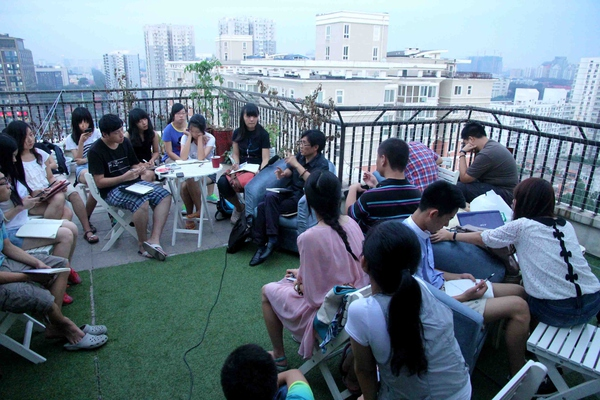

## 立人大学的特色在哪儿?

作者：刘嘎吱

原文：https://www.zhihu.com/question/20948355/answer/21469833

众所周知的有说法很多，比如努力突破传统教育模式、理想主义、游学、自主设计课程邀请导师等。

立大的参与者多是高中应届毕业生或者是本科、硕士在读。邀请导师和设计课程、活动都是自主进行。

谈谈我自己的经历吧。

我是立人大学2013上海组的摄影义工。作为摄影义工，po几张图来显得更加直观。

13年的暑期上海组由于种种原因没有能够持续下去，仅仅在上海呆了两天就被迫离开。

而且仅仅是这两天我们也不能够稳定的在场地内活动，因此我所在的游学小组展开了自主设计的人文徒步。

 在季风书园和陌生人交流

 在老租界的人文徒步（苦中作乐文艺一把~）

后来由于压力我们不得不停止活动并离开上海。

仅仅在一起呆了两天，大家互相不熟悉，因此在离开的早晨，我们把原本比较沉重的离别之会改成了「真人图书馆」，大家互相进行了了解。之后各奔东西。

接着我就坐上了北上的火车来到北京，加入了北京的游学。

刚到北京，晚上的第一节课是梁晓燕老师的，老师要求大家坐成一圈，这样每个人都可以不用回头地面对大家。就这样我们互相交流，度过了我在立大不一样的第一节课。

 
这张后来印成立大明信片啦

分享结束后梁晓燕老师还邀请我们隔日一同去爬黄花岭长城。

黄花岭长城依山傍水且游人不多，休息的时候梁老师还同大家分享了新鲜的杏仁和自己的故事。

我们去了「草场地」拜访吴文光老先生，大家一起做游戏。了解「民间记忆计划」

也去了迷笛音乐学校感受摇滚和张帆校长交流迷笛以及立人的故事

在北京鉴于场地限制等因素我们也是分小组进行活动，只有在集中上课或者集体讨论时大家才会聚在一起。

最后的几天我们在被我们称作「宇宙中心」的五道口度过，我们在706青年空间上课和活动

 
夏天傍晚的706天台，树才先生在给大家讲诗歌

 
临别的下午，大家在706天台一起歌唱

 
706的萌猫，我们上课它就在旁边zzzzzZZ

---
**嗯，更多的课程和活动我就不一一详说了**

其实同老师的交流应该称作**分享**而不是上课，因为我们不是为了学习系统的知识而来。

我们是来同各种各样的、不同领域的、有趣的、有想法的人进行交流的。我们在了解他们的思想、他们的知识领域、他们所从事的事情的同时，导师们也在了解我们，了解立人大学和我们这群有趣的青年，了解我们都在关心什么。

课程设计完全义工自主，之后学员进入后也充分融入，学员也可以设计活动，邀请导师。

我们在邀请导师们的时候往往导师们交流几句便欣然答应前来分享交流。

在我们上海组被迫离开上海分散到其他城市游学的时候，我们向导师们发去了通知表达歉意，导师们表示理解，一些导师也主动提出可以前往其他城市同我们进行小规模的交流。这让我们非常感动。

 
北京组的导师们在立大文集上的签名

* * *
**立大真的带给了我很多改变了我很多**

相信很多人了解立人大学都是因为当年南方周末的那篇《大学在人间》的文章。

我也是通过那篇文章初次了解立人大学的。

后来很多立大的小伙伴告诉我参与立大是因为可以接触到很多的导师。而我却不一样，高中的学业压的我喘不过气来的时候我偶然读到了《大学在人间》，我立刻就被那种**不同于我十几年的受教育经历的教育环境**所吸引，甚至当时读书不多的我还不认识刘瑜、张健、熊培云等。我就是被那种开放的、多元的、理想主义的环境所吸引。

2012年的第二期，由于高考以及父母的限制没有报名第二期立大。

2013年我看到立大招募游学义工，自己又是摄影专业的学生，就报名了摄影义工。（不过游学期间常被大家吐槽渣技术哈哈）
在和同组义工的交流中我发现了自己很多的不足，于是我开始让大家给我推荐书籍并尝试自己给自己列书单来系统地读书。这是立大带给我的改变。

上海义工小组组长华夏在写给学员的「[大学，是和世界谈一场恋爱](huaxia.md)」中说：

>青春本来就是一段最美丽的生活。这个时候，我们拥有最纯真的求知欲，最敏锐的感受力，最真实的自我，最健壮的身体。在这个阶段，我们不需要为太多的现实所累，也不需要为未来所困，我们应该在这段时光里生活，而不是不断推迟真正去生活的时间。因此，我不愿说，你们来立大学到的东西对你们的将来有好处。我更愿意，立大的这段时光会让你们感受到青春的幸福和美感，让你的自我充分舒展。

**在立大的最大的一笔收获应该就是认识了众多的「有趣的人」**

华夏在《大学，是和世界谈一场恋爱》中写到：

> 我在最近的几次面试中，常常问大家一个问题。「你觉得有趣和有意义，有没有区别？如果让你选择，你更倾向于做有趣的事，还是有意义的事？」如果我自己回答，我会说，有趣即是意义。我还认为，无趣和反智，简直就是一种罪恶。大家很容易感觉到，有趣相对来说更倾向于个体，而有意义更倾向于社会。但我的观点是，个体就是社会，这个社会上多了一个有趣的人，这个社会就美好了一分。如爱默生所言，「最内在的，终将会成为最外在的。」有趣本身可以是广义的，但必须是和自己的价值观有关的创造。」

在游学期间，他们带给了我许多欢乐和知识，我们常常三五成群交流各自经历或者对某个问题展开讨论直到夜深，也常常聚在一起读诗和歌唱。游学结束后我们也常常在网路上一起交流，比如交流各自的mooc学习经验，比如互相推荐书籍和学者，比如互相介绍推荐有意义的读书会、展览等活动并结伴参加。

**你心中理想的大学是什么样子的？哈佛？西南联大？巴学园？或者是死亡诗社和放牛班？**

立人大学名誉校长刘道玉老先生在 2013 游学班的开学典礼上的说道：

> 立人大学是一个草根性大学，草根没有什么不好，她有强大是生命力。正如唐朝诗人白居易16岁写的诗所云：「野火烧不尽，春风吹又生」。立人大学的生命力就在于她扎根于广袤的大地，是没有什么力量能够摧毁她的。立人大学的宗旨的立人，什么叫「立人」？这使我想起了孙中山先生的名言，他说：「教育是人的建设，教育的功能可以说是完成人的建设。」我认为「立人」就是人的建设。教育的根本问题就是人的问题」

> 「我希望每一个来到立人大学的学生，既是胸怀大志者，又是脚踏实地耕耘者，每个人都是自己命运的承担者和主宰者！立人大学暑期学校，每一期只有15天左右，显然不可能满足你们求知的欲望。但是，立人大学只是每个人成才的一个起点，今后的路要靠每个人自己去走。立人大学没有围墙，也没有毕业的限期，凡是进入到立人大学的人，永远是立人大学的人，相信立人大学这个雪球会滚越大。也许，再过50年，当你们在回首往事的时候，一定会为你们的这一段经历而自豪！到那时，人们对立人大学也将刮目相看，一个与众不同的大学必将显示出强大的生命力！

（全文见[游学班是教育制度的创新](lrc2013.md))

每个人对于理想的大学的想法都不一样，而立大就是一个很好的平台，在这里每一个参与者都能够充分展示自己的想法并付诸行动，立人大学是所有人的样子，那么理想的大学同样也是所有人的样子。

**自由地学习交流以及认识有趣的人便是我认为的立人大学的最大特色所在。**

给大家推荐一篇很有意思的文章「[自由孩子全攻略](http://www.15yan.com/topic/gei-da-xue-sheng-de-xin/8UwLaq2a20H/)」，由立人乡村图书馆的工作人员写成，很有趣很值得读读。

---
当然立人大学也在不断的发展活动形式，立人大学最新的一年期游学计划正在进行中。
码了一个多小时，不完善的地方下次再补充，更多信息欢迎访问立人大学的新浪微博（at）LRC 立人大学、豆瓣立人大学的小站、以及网站立人大学欢迎你！

---
以上就是我作为一个参与者从我的角度的一些看法。当然每个人眼中的立人大学都是不一样的。

「让理想主义更理想主义，让脚踏实地更脚踏实地。」

---
2015.3.14，检查邮箱翻到两年前录取立大义工的邮件。

立大有什么特色？哪里有什么特色，我认为这只是再普通不过的青年活动。

其实立大的问题很多，现在看来甚至有点「鸡肋」：组织混乱，问题反复发生，经费不足，等等。

可因为所在环境的特殊，被贴上了各种标签。

现在立大停掉了，也不必再抱着所谓的「理想主义」不放了。

读书的读书、考研的考研、出国的出国、经商的经商，做记者、教师、工人、农民、医生、学者、公务员、工程师、科研工作者...

年轻的一代能够以极大的热情投入理想主义，也同样能够以极大的热情投入社会，投入工作和生活，那么这土地就有希望。

立人大学没什么特色，所谓的特色大概是中国特色。

---
最后跟大家分享一首诗，「愿你的道路漫长」。

**原野上走路——三千里步行之二**

**穆旦**

**我们终于离开了渔网似的城市，
那以窒息的、干燥的、空虚的格子
不断地捞我们到绝望去的城市呵！**

**而今天，这片自由阔大的原野
从茫茫的天边把我们拥抱了，
我们简直可以在浓郁的绿海上浮游。**

**我们泳进了蓝色的海，橙黄的海，棕赤的海……
Ｏ！我们看见透明的大海拥抱着中国，
一面玻璃园镜对着鲜艳的水果；**

**一个半弧形的甘美的皮肤上憩息着村庄，
转动在阳光里，转动在一队蚂蚁的脚下，
到处他们走着，倾听着春天激动的歌唱！**

**听！他们的血液在和原野的心胸交谈，
（这从未有过的清新的声音说些什么呢？）
Ｏ！我们说不出是为什么（我们这样年青）
在我们的血里流泻着不尽的欢畅。**

**我们起伏在波动又波动的油绿的田野，
一条柔软的红色带子投进了另外一条
系着另外一片祖国土地的宽长道路，
圈圈风景把我们缓缓地簸进又簸出，
而我们总是以同一的进行的节奏，
把脚掌拍打着松软赤红的泥土。**

**我们走在热爱的祖先走过的道路上，
多少年来都是一样的无际的原野，
（Ｏ！蓝色的海，橙黄的海，棕赤的海……）
多少年来都澎湃着丰盛收获的原野呵，
如今是你，展开了同样的诱惑的图案
等待我们的野力来翻滚。所以我们走着
我们怎能抗拒呢？Ｏ！我们不能抗拒
那曾在无数代祖先心中燃烧着的希望。**

**这不可测知的希望是多么固执而悠久，
中国的道路又是多么自由和辽远呵……**

**1940年10月25日**